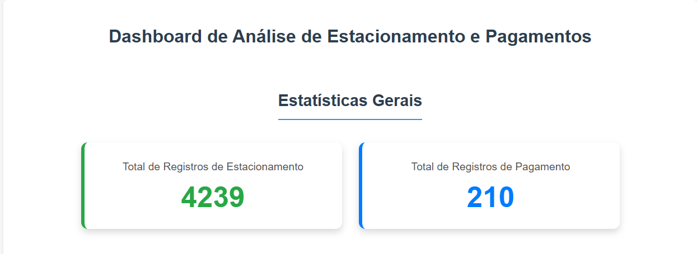
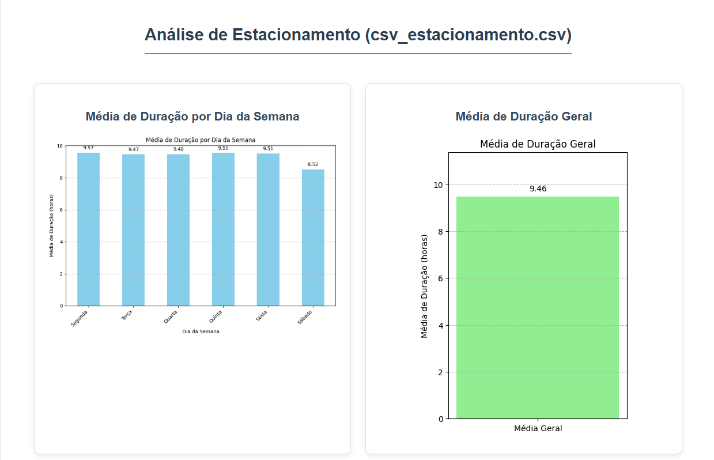
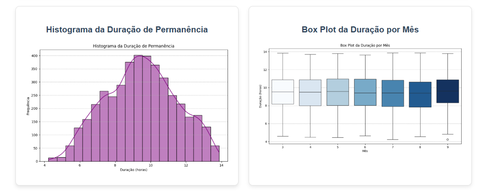
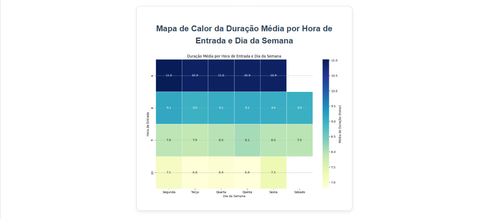
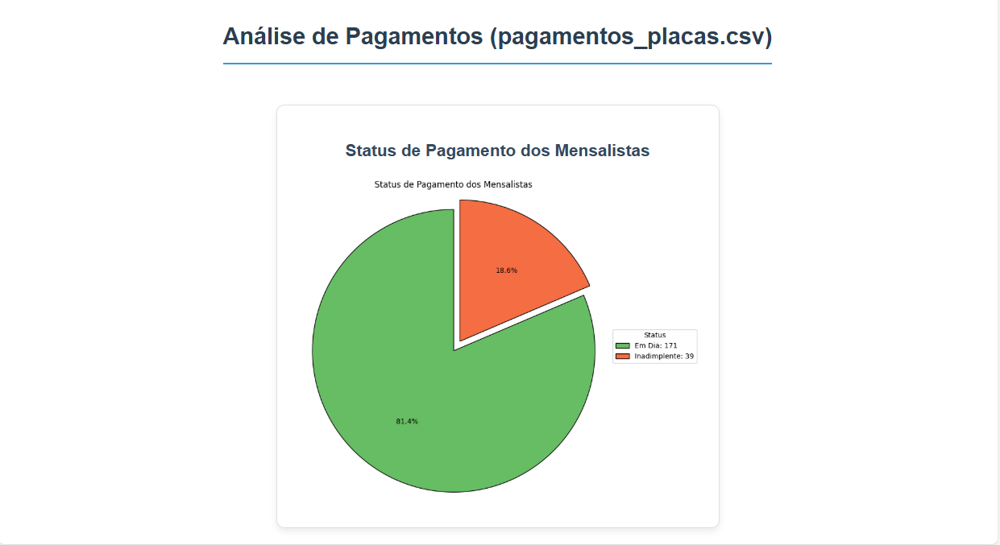

# Databay - Projeto Integrador em Computação IV - DRP01-PJI410-SALA-001GRUPO-016

Repositório da disciplina do Projeto Integrador em Computação IV pela Univesp do grupo DRP-01-PJI410-SALA-001GRUPO-016.

## Sumário
1. [Tema](#tema)
2. [Problema](#problema)
3. [Objetivo](#objetivo)
4. [Recursos de Dados](#recursos-de-dados)
    - [Dataset Entrada e Saída em CSV](#dataset-entrada-e-saída-em-csv)
    - [Dataset Entrada e Saída em CSV Tratado](#dataset-entrada-e-saída-em-csv-tratado)
    - [Dataset Pagamento em CSV](#dataset-pagamento-em-csv)
    - [Dataset Pagamento em CSV Tratado](#dataset-pagamento-em-csv-tratado)
5. [Aplicativo Flask para Análise de Dados de Estacionamento](#aplicativo-flask-para-análise-de-dados-de-estacionamento)
    - [Funcionalidades](#funcionalidades)
6. [Detalhes do Código](#detalhes-do-código)
    - [`app.py`](#apppy)
    - [`index.html`](#indexhtml)
7. [Resultados](#resultados)

---

# Databay – Sistema de Inteligência Analítica para Estacionamentos

## Tema

Implementação de análise de dados que são gerados pelo fluxo diário de veículos em um estacionamento de uma instituição religiosa, disponibilizando interface para visualização e gerenciamento.

## Problema

Os dados acumulados no registro de movimentações diárias de veículos automotores em um estacionamento de uma instituição religiosa não têm sido aproveitados, tornandose apenas armazenamento de informações quase obsoletas. Tais dados poderão ser utilizados de forma estratégica para a tomada de decisões e melhorias operacionais, além de possibilitarem uma visão clara e objetiva dos acontecimentos. Este estacionamento é gratuito para membros, porém, outras pessoas procuram a entidade para se tornarem mensalistas. Isso acontece porque a localização da organização é privilegiada em relação ao acesso a transportes públicos — próxima à estação da CPTM e na rota de ônibus executivos — ou seja, é um local onde se pode deixar veículos em segurança e direcionar-se à capital para o trabalho.

## Objetivo

Transformar registros operacionais em informações estratégicas, permitindo: Identificação de horários de pico e períodos de baixa demanda; Monitoramento da rotatividade e tempo médio de permanência; Classificação de perfis de usuários inadimplentes; Detecção de comportamentos atípicos ou recorrentes; Apoio à tomada de decisões para melhorias operacionais. Também faz parte do objetivo cumprir, por meio deste projeto, todos os requisitos da disciplina acadêmica.

## Recursos de Dados

Os dados utilizados neste projeto estão localizados no diretório `analise_dados_flask/dataset/`.

* [**Dataset Entrada e Saída em CSV (`csv_estacionamento.csv`)**](analise_dados_flask/dataset/csv_estacionamento.csv)
    * Contém as entradas e saídas de veículos.
* [**Dataset Entrada e Saída em CSV Tratado (`csv_estacionamento_tratado.csv`)**](analise_dados_flask/dataset/csv_estacionamento_tratado.csv)
    * Versão processada do dataset de estacionamento, com colunas calculadas como duração, mês, dia da semana etc.
* [**Dataset Pagamento em CSV (`pagamentos_placas.csv`)**](analise_dados_flask/dataset/pagamentos_placas.csv)
    * Contém informações sobre os pagamentos dos mensalistas.
* [**Dataset Pagamento em CSV Tratado (`pagamentos_placas_tratado.csv`)**](analise_dados_flask/dataset/pagamentos_placas_tratado.csv)
    * Versão processada do dataset de pagamentos, incluindo o `Status_Pagamento`.

## Aplicativo Flask para Análise de Dados de Estacionamento

Este é um aplicativo web simples construído com Flask para realizar a análise exploratória de dados de registros de estacionamento e pagamentos. Ele processa arquivos CSV, trata os dados e gera diversos gráficos e KPIs para visualizar padrões de duração de permanência, horários de pico, e status de pagamento dos mensalistas.

### Funcionalidades

* **Processamento e Tratamento de Dados:**
    * Lê dados de estacionamento e pagamento de arquivos CSV.
    * Converte strings de data e hora em objetos `datetime`.
    * Calcula a duração da permanência em horas para estacionamento.
    * Extrai mês, dia da semana e hora de entrada para análise.
    * Classifica o `Status_Pagamento` (Em Dia ou Inadimplente) para o dataset de pagamentos.
    * Trata casos de saída no dia seguinte e valores ausentes.
    * Cria arquivos CSV tratados para ambos os datasets no diretório `dataset` do projeto.
* **Key Performance Indicators (KPIs):**
    * Exibe o **Total de Registros de Estacionamento** e **Total de Registros de Pagamento** em cards visuais e interativos no dashboard.
* **Análise Exploratória de Dados (EDA) para Estacionamento:** Gera os seguintes gráficos:
    1.  **Média de Duração por Dia da Semana:** Um gráfico de barras mostrando a duração média de permanência em cada dia da semana.
    2.  **Média de Duração Geral:** Um gráfico de barras simples exibindo a duração média de permanência em todo o conjunto de dados.
    3.  **Histograma da Duração de Permanência:** Um histograma para visualizar a distribuição das durações de permanência.
    4.  **Box Plot da Duração por Mês:** Um box plot que mostra a distribuição da duração de permanência para cada mês.
    5.  **Mapa de Calor da Duração Média por Hora de Entrada e Dia da Semana:** Um mapa de calor que visualiza a duração média de permanência em diferentes horas do dia e dias da semana, identificando horários de pico ou padrões de uso.
* **Análise Exploratória de Dados (EDA) para Pagamentos:** Gera o seguinte gráfico:
    1.  **Gráfico de Status de Pagamento dos Mensalistas:** Um gráfico de setores (pizza) mostrando a proporção de mensalistas "Em Dia" e "Inadimplentes".
* **Visualização Web:** Apresenta todos os gráficos, KPIs e estatísticas de forma interativa e responsiva em um dashboard web.

## Detalhes do Código

### `app.py`

Este arquivo contém a lógica de backend do aplicativo Flask.

* **Importações**: Carrega bibliotecas como `pandas`, `numpy`, `matplotlib`, `seaborn`, `flask`, `io`, `base64` para manipulação de dados, geração de gráficos e interface web.
* **`formatar_duracao_numerica(td)`**: Função auxiliar que converte objetos `Timedelta` em duração em horas.
* **`tratar_dados_estacionamento(df)`**: Pré-processa o DataFrame de estacionamento, calculando durações, extraindo componentes de data/hora (mês, dia da semana, hora de entrada) e tratando dados ausentes.
* **`tratar_dados_pagamento(df_pagamentos)`**: Pré-processa o DataFrame de pagamentos, calculando o `Status_Pagamento` baseado na data limite e dia de pagamento.
* **`gerar_grafico(fig, ax, ...)`**: Função utilitária que salva uma figura Matplotlib em um `BytesIO` e a codifica em Base64 para ser incorporada diretamente no HTML.
* **`gerar_grafico_status_pagamento(df_pagamentos)`**: Função específica para criar o gráfico de setores de status de pagamento, incluindo lógica de cores e legendas.
* **`realizar_analise_completa()`**: A função principal de análise de dados.
    * Carregamento e tratamento de `csv_estacionamento.csv` e `pagamentos_placas.csv`.
    * Geração de todos os gráficos de estacionamento (5) e de pagamento (1).
    * Salvamento dos DataFrames tratados em arquivos CSV.
    * Retorna um dicionário com estatísticas (total de registros) e as strings Base64 de todos os gráficos.
* **`@app.route('/')` (função `index()`):** A rota principal do aplicativo. Chama `realizar_analise_completa()` e renderiza o template `index.html`, passando todas as estatísticas e gráficos para exibição.

### `index.html`

Este é o template HTML que constrói a interface do usuário do dashboard.

* **Design Responsivo**: Utiliza CSS para criar um layout responsivo, adaptando-se a diferentes tamanhos de tela.
* **Key Performance Indicators (KPIs)**: Exibe o total de registros de estacionamento e pagamento em cards, com cores distintas e efeitos.
* **Estrutura de Gráficos**: Cada gráfico é renderizado dentro de um contêiner estilizado (`
`), garantindo uma apresentação visual consistente.
* **Incorporação de Imagens**: As imagens dos gráficos geradas pelo Flask são incorporadas diretamente no HTML usando `src="data:image/png;base64,{{ nome_da_variavel_do_grafico }}"`, eliminando a necessidade de arquivos temporários.
* **Mensagens de Erro**: Blocos condicionais (``) exibem mensagens de erro amigáveis caso os dados não possam ser carregados ou um gráfico não possa ser gerado.

## Resultados

Abaixo, algumas imagens dos gráficos gerados pelo aplicativo:

*Início de dashboard e KPIs*

*Gráficos 1, 2: Média de Duração por Dia da Semana e Média de Duração Geral*

*Gráficos 3, 4: Histograma da Duração de Permanência e Box Plot da Duração por Mês*

*Gráfico 5: Mapa de Calor da Duração Média*

*Gráficos 6: Gráfico de Setores de Status de Pagamento dos Mensalistas*
